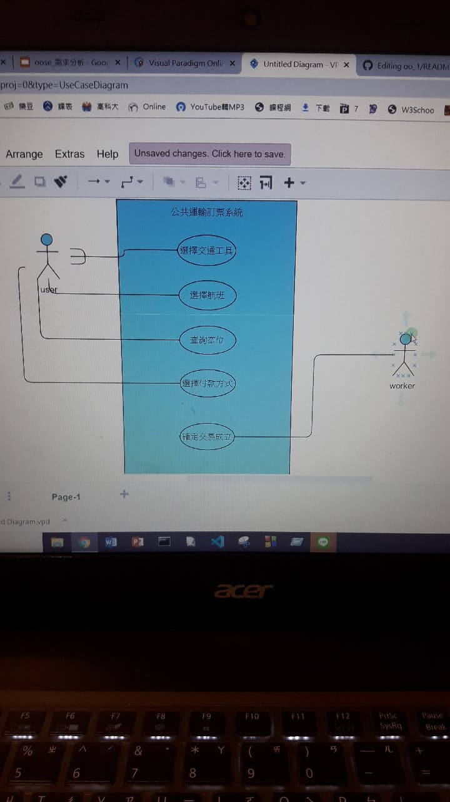
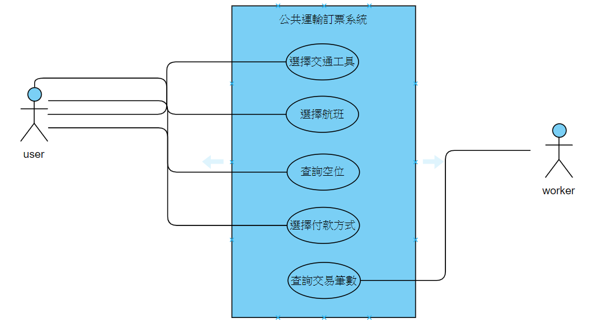

1. 專題題目
2. 文字敘述專題需求
3. 寫出專題之功能性需求與非功能性需求
4. 畫出 使用案例圖 (use case diagram)
5. 由上而下 排出 使用案例的重要性
6. 寫出 其中的 至少三個使用案例
7. 寫出 user story 

1.專題題目:公共運輸訂票系統

2.專題需求:讓使用者可以先選擇要搭乘的交通運輸工具,班次再進行訂票的動作

3.功能性需求:可以選擇要搭乘的交通工具,可以選擇要搭乘的班次,可以選擇付款的方式,可以查詢是否還有空位,確定交易成立

非功能性需求:系統一次可以處理多少要求,線上付款是否安全

4.使用案例圖

6.使用案例:使用者可以使用本系統選擇要搭乘的交通工具
   
         使用者可以使用本系統查詢要搭乘的班次
         
         使用者可以使用本系統選擇如何付款
         
         使用者可以使用本系統查詢是否還有空位
         
         員工可以使用本系統確認交易是否完成
 
 7.USER STORY
 
 身為一個客人,我希望可以得知班次的時間,這樣才可以知道何時要準備出發去搭乘
 
 身為一個員工,我希望可以得知交易是否完成,才知道是否要幫顧客留位置

