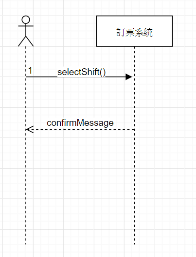

1. 專題題目
2. 文字敘述專題需求
3. 寫出專題之功能性需求與非功能性需求
4. 畫出 使用案例圖 (use case diagram)
5. 由上而下 排出 使用案例的重要性
6. 寫出 其中的 至少三個使用案例
7. 寫出 user story 

1.專題題目:公共運輸訂票系統

2.專題需求:讓使用者可以先選擇要搭乘的交通運輸工具,班次再進行訂票的動作

3.功能性需求:可以選擇要搭乘的交通工具,可以選擇要搭乘的班次,可以選擇付款的方式,可以查詢是否還有空位,確定交易筆數

非功能性需求:系統一次可以處理多少要求,線上付款是否安全

4.使用案例圖

5.選擇交通工具
  
  選擇航班
  
  查詢座位
  
  選擇付款方式
  
  查詢交易筆數

6.使用案例:

選擇要搭乘的交通工具:

1.打開訂票系統

2.選擇自己想搭乘的公共運輸工具

查詢班次:

1.選擇完公共運輸工具的種類

2.查詢該公共運輸工具的班次

3.選擇自己要搭乘的班次

選擇付款方式:

1.選擇完要搭乘的班次

2.選擇要付款的方式

3.完成付款,交易完成
   
        
 
 7.USER STORY
 
 身為一個user,我希望可以得知班次的時間,這樣才可以知道何時要準備出發去搭乘
 
 身為一個worker,我希望可以得知交易筆數,才知道公司的盈利狀況

初步類別圖

系統循序圖

強韌圖

總和類別圖

